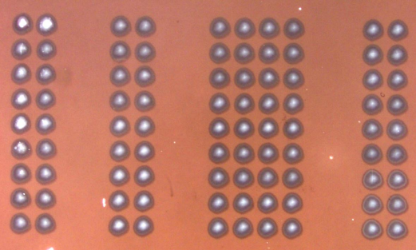

"Laser-Dot-Intensity" 

A laser-written pattern of dots on a photo-sensitive 10 mm x10 mm material sample is
presented in figure below

The pattern is read by first collecting its images when illuminating the sample with 532 nm
left-circularly polarised light and then images are collected when illuminating the same
pattern with right circularly polarised light. Each image intensity is normalised to the image
intensity of the original film. The final signal is a difference image between the two
normalised images obtained with illumination using left and right circular polarisations.

This is an interview assignment to write a python code to automatically recognise the dots and compare the intensities between
the two images obtained with different illumination.

